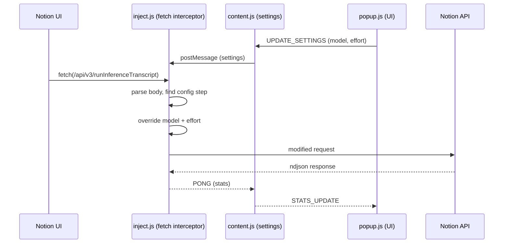

<div align="center">

#  Notion Effort

**Chrome extension для управления AI-моделью и уровнем reasoning в Notion**  
*Перехватывает запросы к Notion AI и подменяет модель/усилие на нужные*

<p align="center">
  
  
  
  
  
</p>

</div>

---

##  Возможности

| | Функция | Описание |
|---|---------|----------|
|  | **Перехват запросов** | Перехватывает `POST /api/v3/runInferenceTranscript` и модифицирует payload |
|  | **25 моделей** | Все модели Notion AI: OpenAI, Anthropic, Gemini, xAI, Mystery |
|  | **4 уровня усилий** | Low → Medium → High → Max для моделей с поддержкой |
|  | **Статистика** | Счётчик перехваченных и подменённых запросов в реальном времени |
|  | **Минималистичный UI** | Тёмная тема, выбор модели через dropdown, effort через кнопки |
|  | **Статус** | Индикатор активности — зелёный если interceptor работает |

---

##  Установка

1. Скачай или клонируй репозиторий:

```bash
git clone https://github.com/polinchek228/notion-effort.git
```

2. Открой `chrome://extensions/`
3. Включи **Developer mode** (верхний правый угол)
4. Нажми **Load unpacked**
5. Выбери папку `notion-effort`

> [!TIP]
> После обновления кода нажми кнопку 🔄 на карточке расширения в `chrome://extensions/`

---

##  Использование

1. Открой [app.notion.com](https://app.notion.com)
2. Кликни на иконку расширения
3. Выбери модель и уровень усилий
4. Отправляй AI-запросы — расширение перехватит и модифицирует их

---

##  Модели

| Alias | Название | Семейство | Усилия |
|-------|----------|-----------|--------|
| `almond-croissant-low` | Sonnet 4.6 | Anthropic | low / medium / high / max |
| `angel-cake-high` | Sonnet 5 | Anthropic | high |
| `avocado-froyo-medium` | Opus 4.6 | Anthropic | medium |
| `apricot-sorbet-high` | Opus 4.7 | Anthropic | high |
| `ambrosia-tart-high` | Opus 4.8 | Anthropic | low / medium / high / max |
| `acai-budino-high` | Fable 5 | Anthropic | high (🔒 restricted) |
| `orange-mousse` | GPT-5.6 Sol | OpenAI | medium / high |
| `orchid-muffin` | GPT-5.6 Terra | OpenAI | medium / high |
| `olive-jellyroll` | GPT-5.6 Luna | OpenAI | medium / high |
| `oatmeal-cookie` | GPT-5.2 | OpenAI | medium / high |
| `oval-kumquat-medium` | GPT-5.4 | OpenAI | medium / high |
| `opal-quince-medium` | GPT-5.5 | OpenAI | medium / high |
| `vertex-gemini-3.5-flash` | Gemini 3.5 Flash | Gemini | low / medium / high |
| `galette-medium-thinking` | Gemini 3.1 Pro | Gemini | low / medium |
| `xigua-mochi-medium` | Grok 4.3 | xAI | low / medium / high |
| `strawberry-whoopiepie` | SpaceXAI 4.5 | xAI | low / medium / high |
| `fireworks-kimi-k2.6` | Kimi K2.6 | Mystery | — |
| `fireworks-kimi-k2.7` | Kimi K2.7 Code | Mystery | — |
| `baseten-deepseek-v4-pro` | DeepSeek V4 Pro | Mystery | — |
| `baseten-glm-5.2` | GLM 5.2 | Mystery | — |

---

##  Архитектура



**Как работает:**
1. `inject.js` переопределяет `window.fetch` в контексте страницы
2. При запросе к `/api/v3/runInferenceTranscript` парсит body
3. Находит `transcript[0].value.model` и подменяет на выбранную модель
4. Отправляет модифицированный запрос в Notion API

---

##  Технологии

| Категория | Технология |
|-----------|-----------|
| Платформа | Chrome Extension Manifest V3 |
| Перехват | Fetch API override (page context) |
| UI | Vanilla HTML/CSS/JS, тёмная тема |
| Хранение | chrome.storage.local |

---

##  Структура проекта

```
notion-effort/
├── manifest.json          # Manifest V3 конфигурация
├── inject.js              # Fetch interceptor (page context)
├── content.js             # Content script — мост между popup и inject
├── background.js          # Service worker — хранение статистики
├── popup.html             # UI расширения
├── popup.js               # Логика popup (модели, effort, статистика)
├── icons/
│   ├── icon16.png
│   ├── icon48.png
│   └── icon128.png
└── README.md
```

---

##  Troubleshooting

| Проблема | Решение |
|----------|---------|
| **Расширение не активно** | Обнови страницу Notion после установки расширения |
| **Модель не меняется** | Открой DevTools → Console, проверь есть ли логи `[Notion Effort]` |
| **Нет иконки** | Перезагрузи расширение в `chrome://extensions/` |
| **Запросы не перехватываются** | Убедись что ты на `app.notion.com`, а не на другом домене |

---

##  Contributing

PR и issue приветствуются!

```bash
git clone https://github.com/polinchek228/notion-effort.git
cd notion-effort
# Внеси изменения
# Загрузи в chrome://extensions/ как unpacked для теста
```

---

##  Disclaimer

> [!WARNING]
> Это **неофициальный** инструмент. Notion не одобряет модификацию запросов.
>
> - Используй на свой страх и риск
> - Расширение не отправляет данные на сторонние серверы
> - Все настройки хранятся локально в браузере

---

<div align="center">

**MIT License** © 2026

</div>
